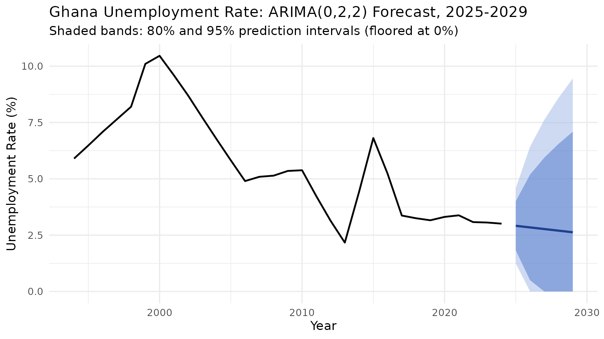

# Ghana Unemployment Analysis & Forecasting (1994–2024)

Regression and Box-Jenkins ARIMA analysis of 31 years of Ghana labour-market data, with a 5-year forecast (2025–2029). Built in **R** as part of my B.Tech (Statistics with IT) thesis at Tamale Technical University.



## Questions answered
1. How has unemployment in Ghana moved since 1994?
2. Which macroeconomic factors are associated with it (GDP growth, inflation, population)?
3. Where is it heading over the next five years, and how uncertain is that?

## Data
Annual data, 1994–2024 (31 observations): unemployment rate, GDP growth, inflation, population and population growth rate. Sources: Ghana Statistical Service, World Bank World Development Indicators, ILO. File: `data/ghana_unemployment_1994_2024.csv` (rates stored as decimals, e.g. 0.059 = 5.9%).

## Method
| Step | Technique |
|---|---|
| Relationships | Multiple linear regression; VIF (multicollinearity); Durbin-Watson (autocorrelation) |
| Stationarity | Augmented Dickey-Fuller test on level, 1st and 2nd differences |
| Model selection | ACF/PACF identification; AIC/BIC comparison of 4 candidate ARIMA models |
| Validation | Ljung-Box test and residual plots |
| Forecast | ARIMA(0,2,2), 80% and 95% prediction intervals |

## Key results
- **GDP growth significantly reduces unemployment** (p = 0.022); population size was also significant (p = 0.005). Inflation and population growth rate were not.
- The regression explains **70.8%** of the variation in unemployment (R² = 0.708).
- The series needed **second differencing** to become stationary (ADF p = 0.01).
- **ARIMA(0,2,2)** had the lowest AIC (79.61) and BIC (83.72); residuals behave like white noise (Ljung-Box p = 0.63).
- Forecast: unemployment drifts from **2.91% (2025) to 2.63% (2029)**, but the intervals widen sharply, so long-range values should be read as a trend, not a precise prediction.

## Limitations
- Only four macroeconomic predictors; many other drivers (education, sector mix, policy) are not modelled.
- The regression shows a Durbin-Watson of 0.73 (positive autocorrelation), which is why ARIMA is used for forecasting.
- ARIMA uses past patterns only and cannot anticipate shocks. With 31 annual points, forecast intervals are wide. Negative lower bounds are model artefacts; the plot floors them at 0%.
- The MAPE (10.5%) is an in-sample training error, not out-of-sample forecast accuracy.

## Run it
```r
install.packages(c("tseries", "forecast", "car", "lmtest", "ggplot2"))
```
```bash
Rscript analysis.R
```
Tables are written to `outputs/` and figures to `figures/`.

## Project structure
```
analysis.R          full analysis (regression + ARIMA)
data/               cleaned dataset
figures/            time series, ACF/PACF, residual diagnostics, forecast
outputs/            result tables (descriptives, model comparison, forecast, regression)
```

## Author
Asare Bernard Odarno — Statistics with IT, Tamale Technical University.
